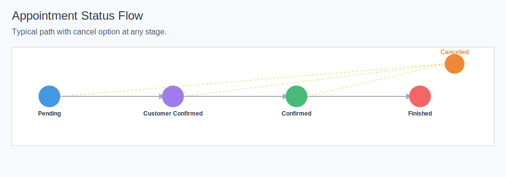

# Appointments

Version: 1.0.29 | Last updated: 2025-11-27

## Why This Matters
Appointments connect your customers, services, and staff into a reliable schedule. When you set the right status and time, the system sends reminders, updates calendar events, and keeps revenue accurate. This helps your team avoid double‑bookings and keeps customers informed.

## When You Use It
- Book a new visit for a customer.
- Reschedule time or change the assigned professional.
- Cancel a visit and notify the customer.
- Review today’s workload and recent activity.

## Appointment Types
- Standard: one service with a fixed duration.
- With add‑ons: base service plus extras that add time and price.
- Custom Time: schedule outside normal slots; the system still checks for conflicts.
- Block Time: reserve time (no customer or service) to protect availability.

## Status Lifecycle
- Pending: created through online checkout or approval. Reminders do not send yet.
- Customer Confirmed: customer verified by email. Teams may auto‑confirm from here.
- Confirmed: staff or auto‑confirmation. Reminders and calendar sync run from this state.
- Finished: service completed; profit and surveys update.
- Cancelled: allowed any time; sends a cancellation notice when email is enabled.

Notes:
- Some screens use “Scheduled” for display, but backend statuses are Pending, Customer Confirmed, Confirmed, Finished, and Cancelled.
- Teams can enable auto‑confirmation: when a customer verifies, the appointment moves to Confirmed automatically.

### Visual Workflow
- Lifecycle overview: 

## What Happens After Changes
- Change date/time or staff: updates your connected calendars for confirmed appointments.
- Cancel: updates calendars and sends a cancellation email when email is enabled.
- Finish: records revenue metrics and sends a survey invitation (if surveys are enabled).
- Edit notes or add‑ons: updates totals and duration; slots reflect the new time.

## How It Connects to Other Features
- Customers: verification moves appointments from Pending to Customer Confirmed.
- Vouchers: valid codes adjust totals; usage is committed when the customer verifies.
- Notifications: reminders send only when status is Confirmed (SMS ~2 hours, email ~24 hours).
- Permissions: staff see and manage only their own appointments; managers/owners see the whole team.
- Calendar Sync: confirmed appointments create/update/delete Google/Microsoft events; external events also block overlapping slots.

## Screenshots
- Appointments list: 
- Create appointment form: 
- Edit appointment form: 
- Appointment details: 
- Appointment groups: 

## Practical Tips
- Select the service first so duration and available staff load correctly.
- Add‑ons change time and price; confirm with the customer before applying.
- Available slots show future times; use Custom Time to record a past visit and validate conflicts.
- Mark Finished promptly so revenue and reports stay accurate.

## Related Guides
- Checkout Flow & Sequential Scheduling: [Read more](checkout_flow.md)
- Notifications & Reminders: [Read more](notifications.md)
- Calendar Integration: [Read more](../calendar/overview.md)
