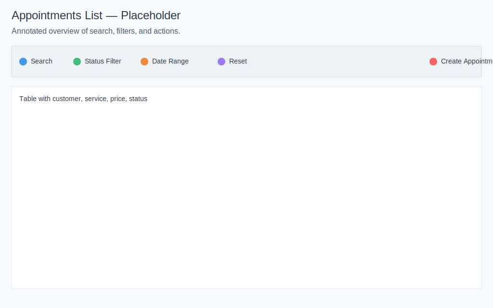
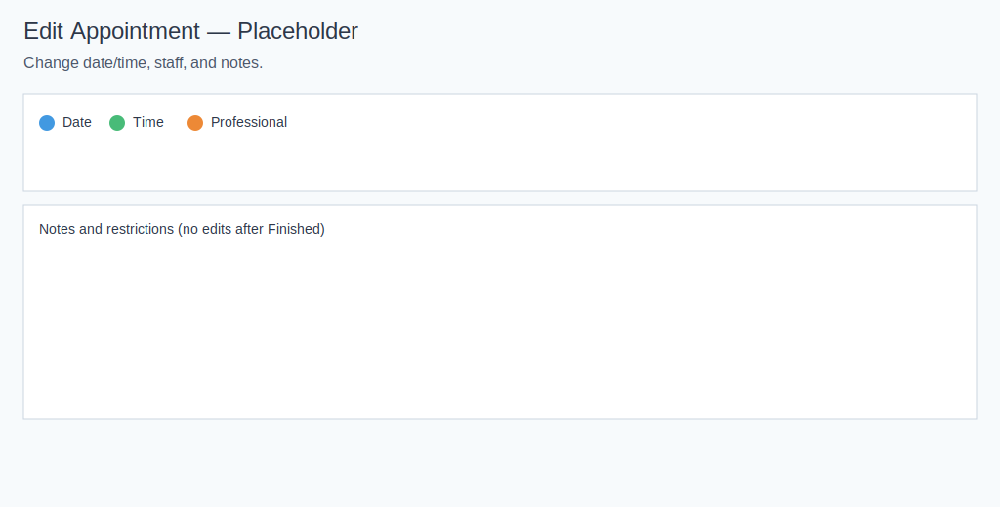
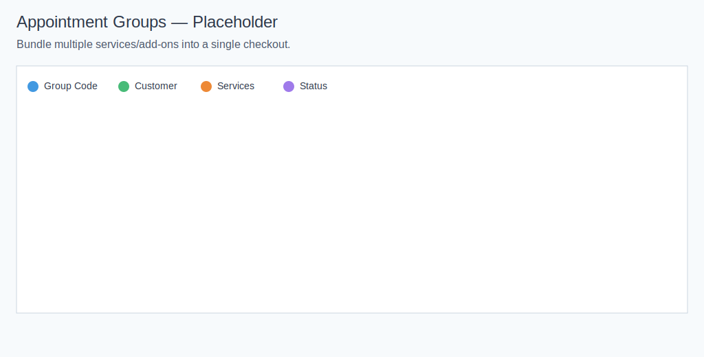

# Appointment Screens and Form Fields

Version: 1.0.29 | Last updated: 2025-11-27

## Appointments List
- Purpose: view, search, and filter all appointments.
- When to use: daily operations, quick status changes, and bulk actions.
- Visual: 
- How to use:
  - Search by customer, service, or ID.
  - Filter by status and date range.
  - Click Create Appointment to start a new booking.
  - Note: The list may show “Scheduled” in filters for convenience. Backend statuses are Pending, Customer Confirmed, Confirmed, Finished, and Cancelled.

## Create Appointment Form
- Purpose: add a new appointment in three simple steps.
- Visual: 
- Fields (what to enter and why):
  - Appointment Date: the day of the visit.
  - Service: the service to provide; shows duration and price.
  - Add-ons (Optional): extras that add time and cost.
  - Customer: who the appointment is for; create a new customer if needed.
  - Professional: staff member who will perform the service; only qualified providers for the selected service appear.
  - Time Preference: choose Available Slots or enter a Custom Time and validate. Available slots show future times with a short buffer; use Custom Time to record a past visit.
  - Promo Code (Optional): apply a code to reduce price when valid; discounts appear in totals.
  - Status: set initial status. Use Confirmed for staff‑created bookings so reminders and calendar sync run. Online checkout creates Pending and moves to Customer Confirmed after email verification; teams may auto‑confirm to Confirmed.
  - Notes (Optional): special requests or instructions.

## Edit Appointment Form
- Purpose: adjust date/time, staff, and notes.
- Visual: 
- How to use:
  - Change date or time (avoid past times).
  - Update the professional if needed.
  - Add notes; avoid editing finished appointments.

## Appointment Details
- Purpose: see full information, totals, discounts, and profit.
- Visual: 
- How to use:
  - Review the customer and contact info.
  - Check applied vouchers and totals.
  - Mark Finished after service to update revenue and send a survey invitation (if enabled).

## Appointment Groups
- Purpose: group multiple services and add‑ons into one checkout and track them with a single Group Code.
- Visual: 
- When to use:
-  - A customer books more than one service at the same time.
-  - You want a single total and an easier way to review status.
-  - You need to see discounts or voucher codes applied to the whole order.
- How to use:
-  - Open Groups from the Appointments header.
-  - Search and filter:
-    - Search by customer name, email, phone, Group Code, or voucher code.
-    - Filter by status: Pending, Customer Confirmed, Confirmed, Finished, Cancelled.
-    - Set a date range to show groups with appointments in that period.
-  - Sort the list by Group ID, Customer, Total Price, or Submitted.
-  - Click “View Details” to open the group modal:
-    - See customer details (name, email, phone).
-    - Review Group Code, total amount, discount applied, and voucher code (if any).
-    - Status shows “Waiting Customer Confirmation” until the customer verifies; after verification, it reflects the main appointment status.
-    - Each appointment shows service name, add‑ons with prices, attendant, date & time, and total.
-  - Use pagination to navigate through results on desktop and mobile.

## Tips & Common Mistakes
- If no groups appear, clear filters or broaden the date range.
- You can only sort by the listed columns; other columns don’t support sorting.
- Staff accounts see only groups that include their own appointments.
- “Customer Confirmed” means the customer completed their confirmation; “Pending” means they haven’t yet.
- Discounts show under totals; add‑ons appear as separate lines with their prices.
