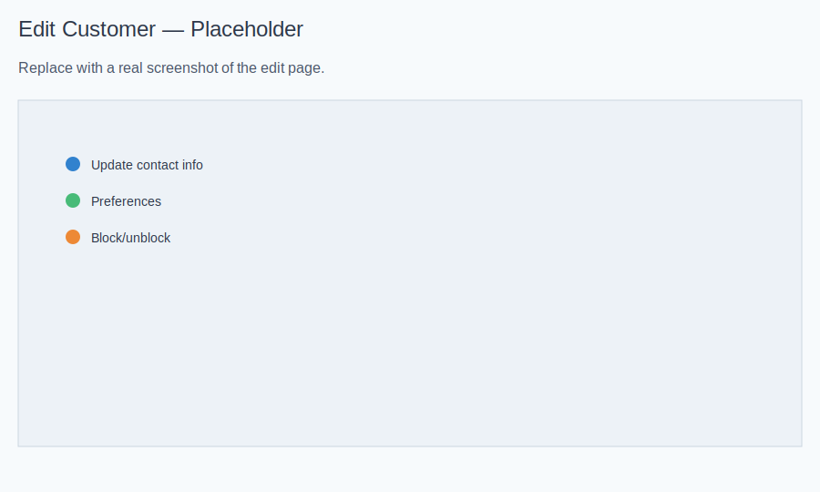

# Customers — Basic Operations

Last updated: 2025-11-27

## Why This Matters
Accurate customer profiles make booking faster and communications reliable. When email and phone are correct, verification links, reminders, and receipts go to the right person. Clear notes help staff deliver consistent service.

## Add a Customer
- Open Customers from your dashboard.
- Click “New Customer”.
- Screenshot: 
- Fill in details:
  - Name: use the name your customer prefers on receipts.
  - Email: used for verification links and email reminders. Disposable emails are blocked.
  - Phone: used for SMS reminders; include country code. Formatting is fine—MyScheduly stores the digits only.
  - Address (optional): helpful for service records.
  - Notes/Preferences: allergies, products, styles, special requests.
- Save and review the profile.

What happens next:
- If you book appointments, reminders will use the saved email/phone once the appointment is Confirmed.
- Duplicate emails are blocked during creation; search first if you see a duplicate message.

## View a Customer
- Search by name, email, or phone.
- Open the profile to see contact info, preferences, and appointment history.
- Screenshot: 

## Edit a Customer
- Open the profile and click “Edit”.
- Update contact info and preferences; save changes.
- Block/unblock if needed and include a short reason.
- Screenshot: 

What happens after changes:
- Updated email/phone are used by future verification links and reminders.
- Blocking does not automatically cancel existing bookings; your team can decide booking rules when blocked.

## Sorting and Stats
- On the Customers list you can sort by Name, Email, Created Date, Total Spent, or Appointment Count.
- Quick stats show most valuable and most active customers, new customers in the last 30 days, and average value per customer.

## Tips
- Add preferences right after appointments while details are fresh.
- Keep notes useful and respectful; avoid sensitive information you don’t need.
- If you receive a duplicate email message when adding, search and reuse the existing profile.

## Verification and Reminders
- Email verification status appears on the customer profile.
- Reminders send only for Confirmed appointments and use the customer’s saved contact details.
