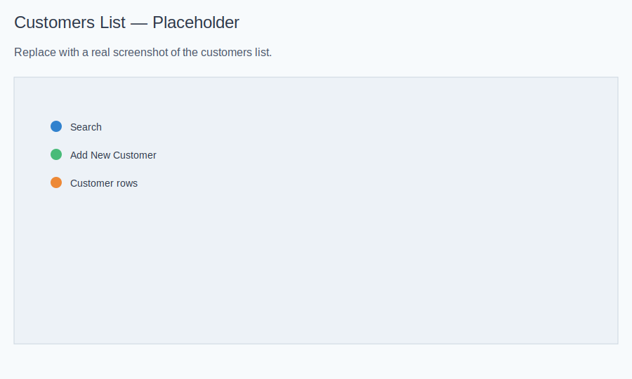

# Customers

Last updated: 2025-11-27

## What It Is and Why It Matters
Use the Customers module to store and manage client details, preferences, and history. A complete customer profile helps your team personalize service, increase repeat bookings, and build long‑term relationships.

## When to Use It
- You want to add a new client before booking.
- You need to update contact info or preferences.
- You want to view past appointments and notes.
- You need to block a client or record account status.

## How It Helps
- Faster bookings with accurate contact details.
- Better service quality with saved preferences.
- Smarter follow‑ups and promotions based on history.

## Screenshots
- Customer list: 
- Customer profile: 

## How to Use
- Open Customers from your dashboard.
- Search by name, email, or phone to find a profile.
- Open any customer to view contact info, preferences, and appointment history.
- Use the buttons to Edit the customer or Book Appointment immediately.

### Identity & Verification
- Purpose: confirm the customer’s identity and contact details.
- Where to see it: the “Identity & Verification” card on the profile.
- What it shows:
-  - Verification status: Verified or Pending.
-  - Verification method: for example, email link.
-  - Token status: whether a confirmation is still pending and when it expires.
- When to use: review before sending reminders or if contact details change.
- Tip: if status is Pending, ask the customer to complete their verification so messages reach the right person.

### Trust & Security
- Purpose: a simple score (0–100) to help assess reliability.
- Where to see it: the “Trust & Security” card.
- What it shows:
-  - Trust score with color cues (green = high, amber = medium, red = low).
-  - Email quality flag (e.g., Unknown, Good).
-  - Account status (Active or Blocked).
- When to use: consider trust score and status when approving bookings or promotions.
- Tip: verified customers usually have higher trust; keep details up to date.

### Profile Notes
- Purpose: quick tags to remember preferences and important details.
- Where to see it: “Profile notes” under Connections & Profile.
- How to use: add notes in the customer edit screen (e.g., Allergies: Lavender; Hair: Curly; Massage: Monthly).
- Benefit: helps staff deliver consistent service, even across different team members.

### Account Status
- Purpose: mark an account as Active or Blocked with a reason.
- Where to see it: Status area on the profile header and Trust card.
- How to use: open Edit, set “Blocked” on, and write a brief reason. Unblock later when appropriate.
- Benefit: avoids unintended bookings and keeps a clear record of decisions.

## Tips & Tricks
- Keep email and phone current to ensure confirmations and reminders work.
- Use clear, helpful notes; avoid sensitive data you don’t need.
- Trust score is guidance, not a rule—review context before blocking.
- If a profile looks incomplete, verify details before booking.
 - Reminders send only when appointments are Confirmed; verify the customer and set status accordingly.
