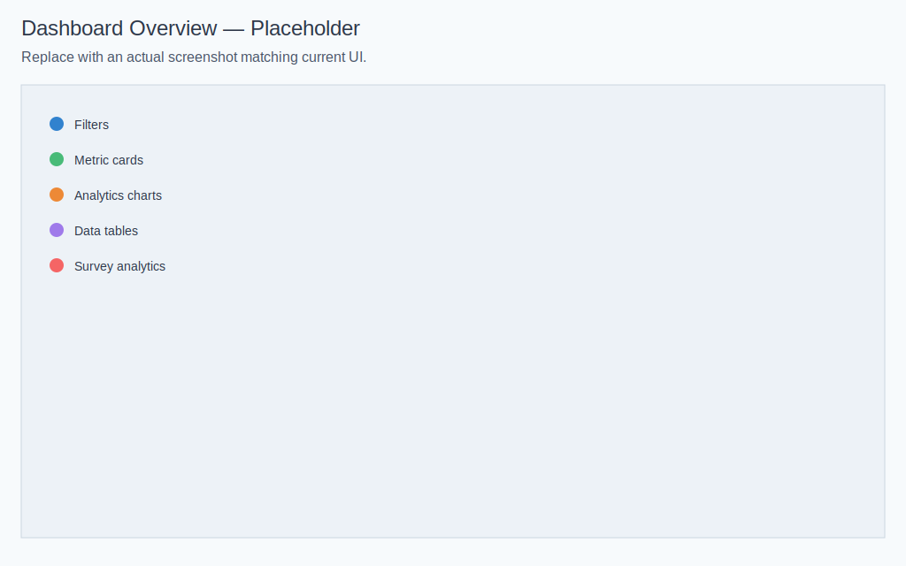
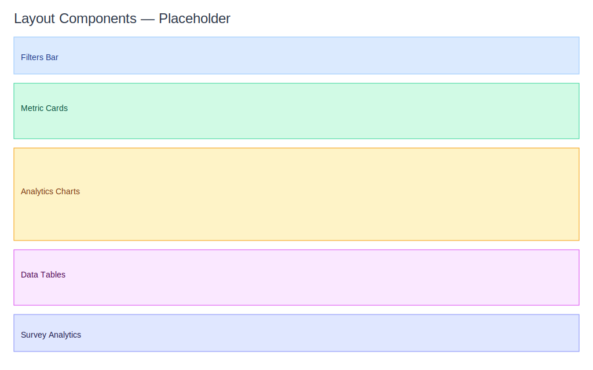

# Dashboard — Usage Guide

Version: 1.0.28 | Last updated: 2025-11-27

This guide helps business users get the most value from the dashboard without technical details.

## Filters and Views
- Date Range: choose common periods like Today, This Week, Last 30 Days, or set a custom start/end date.
- Service: focus on one service to compare performance and bookings.
- Staff: focus on one team member to understand workload and results.
- Tip: start broad (Last 30 Days), then narrow down to a service or staff to answer specific questions.

## Refreshing Data
- Click the Refresh button to load the latest figures for your selected filters.
- Expect numbers and charts to update together so cards, charts, and tables stay in sync.
- There is no automatic refresh; refresh whenever you’ve made changes or want up‑to‑the‑minute results.

## Reading the Dashboard
- Metric Cards: quick health check (revenue, customers, order value, appointments).
- Analytics Charts: trends over time and comparisons to a previous period.
- Tables: detailed lists (service performance and today’s schedule).
- Customer Feedback: ratings, recommendation rate, and recent comments.

## Accessibility and Clarity
- Color tags help you spot increases/decreases at a glance.
- Tooltips and labels explain what each element represents.
- Use larger screens to see more context; on mobile, charts and tooltips adapt for readability.

## Visual Examples
- Overview: 
- Layout Map: 

## Where to Next
- See indicator explanations: [Dashboard — Indicators](indicators.md)
- If something looks off, visit: [Dashboard — Troubleshooting](troubleshooting.md)

## Behavior Details
- Date range behavior: short ranges (up to 31 days) display daily points. Longer ranges (like This Year) display monthly points to keep charts readable. 
- Comparison labeling: each selection includes a clear previous period label (for example, “Previous 30 Days (31–60 days ago)” for Last 30 Days) so trends are easy to compare.
- Timezone impact: the dashboard uses your team’s timezone for all calculations. When you update the timezone in General Settings, “Today” and reminders adjust to your local time automatically.
- Staff vs Manager access: staff accounts are redirected to a focused staff dashboard; owners/managers view the full analytics.
- Revenue trend composition: appointment revenue is always included; gift card sales may be merged into the trend to reflect total cash inflow for the selected period.
- Filters and data sources: filters apply to appointments; gift cards follow their creation date for revenue reporting.
- Permissions: financial cards and analytics may be hidden if your role doesn’t include access to financial data.

## Example
You’re preparing for a monthly review:
- Select This Year to see monthly points and a “Last Year” comparison label.
- Narrow to the Facial service to check upsell performance; AOV rises when add‑ons are bundled.
- Open Voucher Analytics to confirm ROI for your spring promo before planning the next one.

## Best Practices
- Always verify the selected period before drawing conclusions.
- Expect monthly points for long ranges; this is by design for clarity.
- Keep team timezone accurate to make “Today”, weeks, and reminders match your local time.
- Click Refresh after changing filters; the dashboard does not auto‑refresh.
