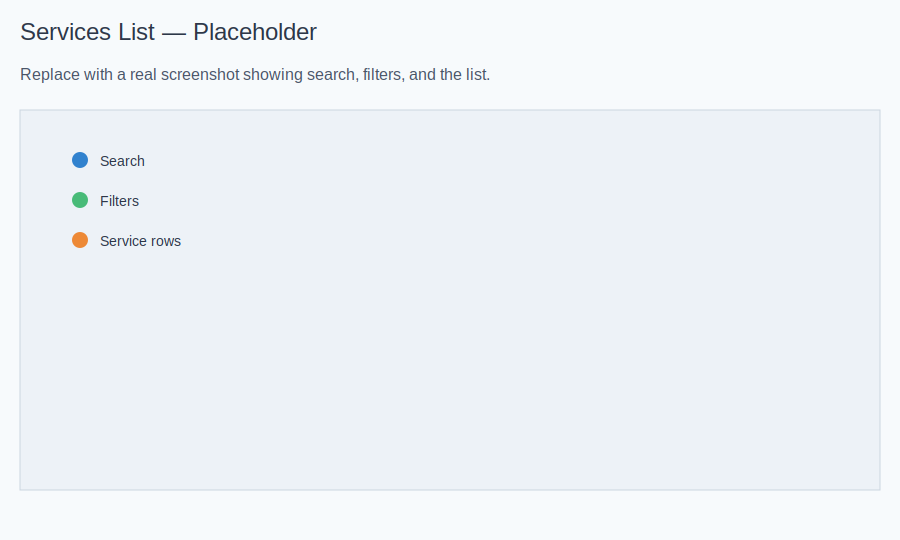
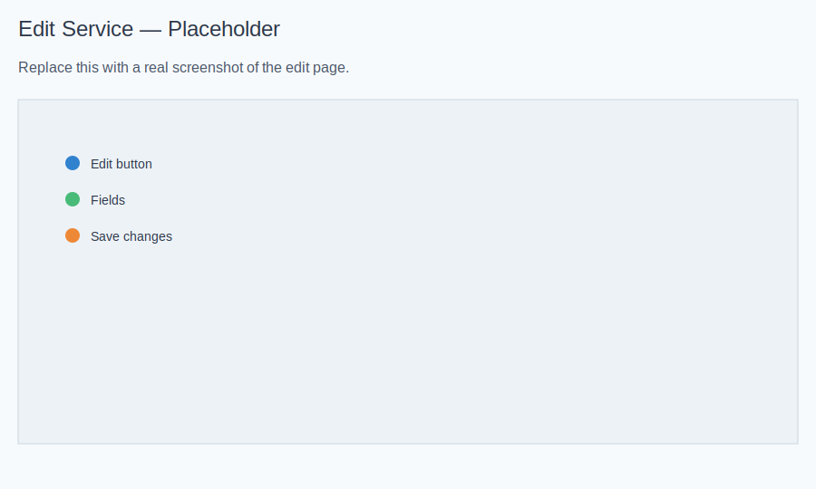

# Services — Basic Operations

Version: 1.0.29 | Last updated: 2025-11-27

## Why This Matters
The right duration and provider assignment keep your schedule accurate. Price and cost drive revenue and margins. Visibility settings control what clients can book.

## Create a Service
- Open Services from your dashboard.
- Click “New Service”.
- Screenshot: 
- Fill in details:
  - Name and Category (required): choose the category this service belongs to.
  - Duration (minutes): used by scheduling and conflict checks.
  - Price and Cost (optional): used for billing and margin reporting.
  - Visibility: show or hide this service on your public booking page.
  - Providers: select staff qualified to deliver this service (at least one required).
  - Click Save and review in the list.

What happens next:
- Appointments use the service’s Duration and Price; add‑ons can extend both.
- Only assigned providers appear in booking forms and can update the service if they are staff.

## View Services
- Search by name; filter by category or provider.
- Click a service to see details, linked add‑ons, and assigned providers.
- Screenshot: 

## Edit a Service
- Open the service and click “Edit”.
- Change name, price, duration, cost, visibility, providers; click Save.
- Screenshot: 

Consequences of changes:
- Shorter/longer durations change slot suggestions and overlapping checks.
- Price changes update totals; financial metrics reflect the new values.
- Visibility immediately affects the public booking page.

## Delete a Service
- Open the service detail page → “Delete” → confirm.
- Note: Deleting removes the service from booking; existing appointments are not automatically cancelled.
- If deletion fails, hide the service instead to retire it without affecting past bookings.
- Screenshot: 

## Tips
- Adjust durations when you see consistent overruns or underruns.
- Keep published prices consistent with your site.
- Use visibility to stage new services before launch.
- Review provider assignments regularly so availability stays correct.
